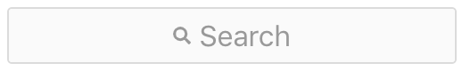

# search-bar-react

 Instagram-inspired react search bar.

## Examples

Default:

 &nbsp;


Mobile:

 &nbsp;


## Install

`npm install search-bar-react --save`

## Usage

```jsx
import SearchBar from 'search-bar-react'

...
<SearchBar
	onChange={(text) => console.log(text)}
	onFocus={() => console.log('focused')}
	size='large'
	width='100%'
	autoFocus
	placeholder='Search...'
	onClear={() => console.log('closed')}
	value='Initial Value'
/>
...
<SearchBar
	mobile
	onClear={() => console.log('cleared')}
/>
...
```

## Props

| Prop | Type | Default | Description |
|-|-|-|-|
| __mobile__ | `Boolean` | `false` | _Use the mobile style version._ |
| __value__ | `string` | `''` | _Initial Value._ |
| __placeholder__ | `string` | `'Search'` | _Search Bar custom placeholder._ |
| __clearBtnText__ | `string` | `'Clear'` | _(mobile version only) custom clear text._ |
| __width__ | `string` | `'280px'` | _Set custom width._ |
| __size__ | `string` | `'default'` | _Select a predefined size `['small','large']`_  |
| __loading__ | `Boolean` |  | _Control loading button behavior. As default the loading button spins for a second after user input._ |
| __autoFocus__ | `Boolean` | `false` | _Autofocus on mount._ |
| __onChange__ | `function` |  | _Callback on input change. Returns `string`._ |
| __onFocus__ | `function` |  | _Callback on input focus._ |
| __onClear__ | `function` |  | _Callback on Clear-Button click._ |

## License
MIT Licensed. Copyright (c) Darwin Bonfante 2019.